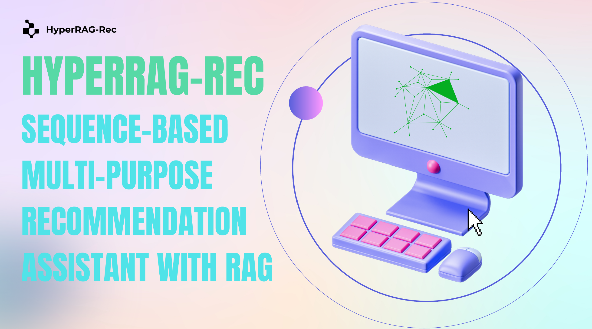
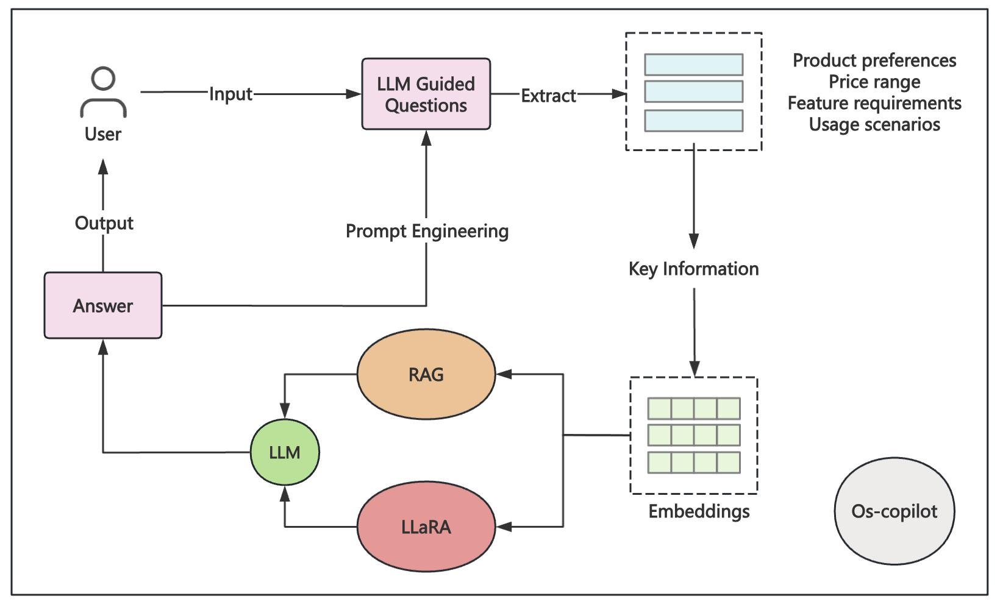

# HyperRAG-REC : Sequence-Based Multi-Purpose Recommendation Assistant with RAG

  

**HyperRAG-REC** is an advanced  Multi-Purpose Recommendation Assistant guidance assistant designed to enhance the online shopping experience by providing personalized product recommendations, answering specific queries, and facilitating feature comparisons. Leveraging **Retrieval-Augmented Generation (RAG)** and **LLaRA (Large Language Recommendation Assistant)**, this project integrates large language models (LLMs) to create a dynamic and interactive shopping assistant.

## What is HyperRAG-REC?

As online shopping becomes increasingly complex, traditional recommender systems often struggle with personalization and understanding nuanced user needs. ShopSmart AI aims to address these limitations by combining information retrieval techniques with generative LLMs to deliver relevant, tailored guidance to shoppers.

  

## Key Features

- **Document Processing Pipeline**: Efficiently processes and chunks documents while preserving context for accurate retrieval.
- **Neural Embedding System**: Generates embeddings for user queries, enabling semantic search and nearest neighbor retrieval.
- **Answer Generation Module**: Produces coherent and relevant answers conditioned on user queries and retrieved documents.
- **Multi-Stage Dialogue System**: Manages interactive sessions that respond to user queries with contextually relevant information and conversational flow.
- **Multi-Model Integration**: Utilizes GPT-4 for complex tasks and locally fine-tuned models for faster, simpler responses.

## Technical Highlights

- **Retrieval-Augmented Generation (RAG)**: Enhances LLM capabilities by integrating external knowledge sources, ideal for handling knowledge-intensive queries.
- **LLaRA**: Specializes in providing product recommendations by combining user behavior data with semantic understanding.
- **Prompt Engineering**: Carefully crafted prompts drive meaningful interactions, accurately capturing user needs and preferences.
- **Context Management**: Maintains conversation history and key preferences to deliver coherent, personalized responses.

## Project Structure

1. **Data Collection & Processing**
2. **Embedding & Retrieval**
3. **Answer Generation**
4. **User Interaction & Optimization**

## Getting Started

- Clone the repository: `git clone https://github.com/syccxdr/ShopSmartAI.git`
- Follow setup instructions in the `INSTALL.md` for dependencies and environment setup.

## Contributors

- Long Xiyu, Zeng Minhang, Su Yingcheng, Yu Yitao, Wang Yike
